# Council Architecture — 35-Agent DAG

The council is the profit-critical decision engine. Every trade signal passes through the full 35-agent DAG before execution. **Sub-1s latency** in normal conditions.

**Last updated:** March 12, 2026 | **Version:** v5.0.0

---

## 1. Visual DAG (Mermaid)

```mermaid
flowchart TB
  subgraph Stage1["Stage 1 — Perception + Academic Edge (13 agents)"]
    M[market_perception]
    F[flow_perception]
    R[regime]
    S[social_perception]
    N[news_catalyst]
    Y[youtube_knowledge]
    I[intermarket]
    G[gex_agent]
    IN[insider_agent]
    FB[finbert_sentiment]
    ET[earnings_tone]
    DP[dark_pool]
    MR[macro_regime]
  end

  subgraph Stage2["Stage 2 — Technical + Data Enrichment (8 agents)"]
    RSI[rsi]
    BBV[bbv]
    EMA[ema_trend]
    RS[relative_strength]
    CT[cycle_timing]
    SC[supply_chain]
    IF[institutional_flow]
    CG[congressional]
  end

  subgraph Stage3["Stage 3 — Hypothesis + Memory (2 agents)"]
    H[hypothesis]
    LM[layered_memory]
  end

  subgraph Stage4["Stage 4 — Strategy (1 agent)"]
    ST[strategy]
  end

  subgraph Stage5["Stage 5 — Risk + Execution + Portfolio (3 agents)"]
    RK[risk]
    EX[execution]
    PO[portfolio_optimizer]
  end

  subgraph Stage55["Stage 5.5 — Debate (3 agents)"]
    BD[bull_debater]
    BED[bear_debater]
    RT[red_team]
  end

  subgraph Stage6["Stage 6 — Critic (1 agent)"]
    CR[critic]
  end

  subgraph Stage7["Stage 7 — Arbiter"]
    ARB[arbiter]
  end

  Stage1 --> Stage2
  Stage2 --> Stage3
  Stage3 --> Stage4
  Stage4 --> Stage5
  Stage5 --> Stage55
  Stage55 --> Stage6
  Stage6 --> Stage7
  Stage7 --> VERDICT[council.verdict]
```



**Post-arbiter (background):** `alt_data_agent` runs for enrichment only; does not block verdict.

---

## 2. Stage summary

| Stage | Agents | Role |
|-------|--------|------|
| 1 | 13 | Perception (market, flow, regime, social, news, YouTube, intermarket) + Academic Edge (GEX, insider, FinBERT, earnings tone, dark pool, macro regime) |
| 2 | 8 | Technical (RSI, BBV, EMA trend, relative strength, cycle timing) + Data enrichment (supply chain, institutional flow, congressional) |
| 3 | 2 | Hypothesis (LLM via brain gRPC) + Layered memory |
| 4 | 1 | Strategy (entry/exit/sizing) |
| 5 | 3 | Risk (VETO), Execution (VETO), Portfolio optimizer |
| 5.5 | 3 | Bull debater, Bear debater, Red team |
| 6 | 1 | Critic (R-multiple postmortem) |
| 7 | 1 | Arbiter (Bayesian-weighted BUY/SELL/HOLD) |

---

## 3. How to add a new agent

### Step 1: Create the agent file

Create `backend/app/council/agents/<name>_agent.py`:

```python
from app.council.schemas import AgentVote

NAME = "my_new_agent"
WEIGHT = 0.7  # Start conservative (0.5–0.8)

async def evaluate(features: dict, context: dict = None) -> AgentVote:
    f = features.get("features", features)
    # Your logic; use f.get("key", default) for feature access
    return AgentVote(
        agent_name=NAME,
        direction="buy",   # "buy" | "sell" | "hold"
        confidence=0.6,
        reasoning="Brief explanation",
        veto=False,       # Only risk + execution may set True
        veto_reason="",
        weight=WEIGHT,
        metadata={},
    )
```

- **Do not** set `veto=True` (reserved for risk and execution).
- On errors, return `direction="hold"`, `confidence=0.0`, and optional `reasoning` with the error.

### Step 2: Register in the registry

In `backend/app/council/task_spawner.py` (or the module that builds `AGENT_REGISTRY`), add an entry that maps the agent type name to the module’s `evaluate` function. The runner uses this registry to resolve agents by type.

### Step 3: Assign stage in runner

In `backend/app/council/runner.py`, add your agent to the correct stage list:

- **Stage 1:** `_stage1_agent_types` (perception / academic edge).
- **Stage 2:** `stage2_configs` (technical / data enrichment).
- **Stage 3:** hypothesis + layered_memory only (add here only if it’s a hypothesis/memory agent).
- **Stage 4:** strategy only.
- **Stage 5:** risk, execution, portfolio_optimizer (do not add new VETO agents here).
- **Stage 5.5:** bull_debater, bear_debater, red_team.
- **Stage 6:** critic only.

Use the same `agent_type` string as in the registry.

### Step 4: Add default weight (optional)

In `backend/app/council/weight_learner.py`, add a default in `DEFAULT_WEIGHTS`:

```python
DEFAULT_WEIGHTS: Dict[str, float] = {
    ...
    "my_new_agent": 0.7,
}
```

### Step 5: Test

```bash
cd backend && python -m pytest --tb=short -q
```

Then run a council evaluation (e.g. POST `/api/v1/council/evaluate` with `{"symbol": "AAPL"}`) and confirm your agent appears in the votes and that the arbiter still produces a valid verdict.

---

## 4. Weight learning system

### Overview

- **Module:** `backend/app/council/weight_learner.py`
- **Role:** After each trade outcome, the learner updates per-agent weights so that agents that align with outcomes get higher weight and others are dampened.
- **Persistence:** Weights are stored (e.g. in DuckDB) and loaded on startup.

### Algorithm (conceptual)

- For each agent vote in a completed trade:
  - If the agent’s direction aligned with the outcome: increase effective weight (e.g. `weight *= (1 + learning_rate * confidence)`).
  - If it did not align: decrease (e.g. `weight *= (1 - learning_rate * confidence)`).
- Weights are normalized (e.g. mean 1.0) so relative scaling is preserved.
- **Regime-stratified learning:** Separate state (e.g. Beta α, β or equivalent) per (agent, regime) so that weights adapt by market regime.
- **Confidence floor:** Only outcomes with confidence ≥ `LEARNER_MIN_CONFIDENCE` (0.20) are used for updates, so low-confidence noise does not dominate.

### Integration

- **Arbiter** (`arbiter.py`): Calls `get_weight_learner().get_weights()` and uses these learned weights for confidence aggregation. Falls back to each agent’s static `WEIGHT` if the learner is unavailable.
- **Feedback loop:** Trade outcomes are fed into the weight learner (e.g. via `feedback_loop.py` or daily outcome jobs). The learner updates its internal state and persists.

### Key constants (in code)

- `LEARNER_MIN_CONFIDENCE = 0.20`
- `learning_rate`, `min_weight`, `max_weight`, `decay_rate` in `WeightLearner.__init__`

---

## 5. Debate and adversarial layer (Stage 5.5)

### Purpose

- **Bull debater:** Argues the bullish case for the trade.
- **Bear debater:** Argues the bearish case.
- **Red team:** Stress-tests the council decision (adversarial).

Their votes are included in the same vote list as other agents and are weighted by the arbiter. They do **not** have veto power.

### Flow

1. After Stage 5 (risk, execution, portfolio_optimizer), the runner invokes Stage 5.5: `bull_debater`, `bear_debater`, `red_team`.
2. Each returns an `AgentVote` (direction, confidence, reasoning).
3. The arbiter aggregates all votes (including debate) using the same Bayesian-weighted logic; veto rules apply only to risk and execution.
4. Debate outcomes can be used for learning: e.g. which side was right can feed into the weight learner or audit trails.

### Wiring

- Debate agents are registered like any other agent and listed in the Stage 5.5 section in `runner.py`.
- Council decision audit trail and calibration endpoints (e.g. `/api/v1/council/calibration`, `/api/v1/council/debates`) can expose debate history and calibration stats.

---

## 6. Arbiter rules (summary)

1. **VETO:** If `risk` or `execution` sets `veto=True` → final decision is **HOLD**, `vetoed=True`.
2. **Required agents:** `regime`, `risk`, and `strategy` must all vote non-hold for a trade to be allowed; otherwise the arbiter can force HOLD.
3. **Confidence:** Final confidence is a Bayesian-weighted combination of all non-vetoing agents’ votes.
4. **Execution threshold:** Execution is allowed only if final confidence exceeds a **regime-adaptive threshold** (e.g. BULLISH/GREEN lower, RED/CRISIS higher) and any other execution-ready checks pass.

---

## 7. AgentVote schema

All agents must return this (from `backend/app/council/schemas.py`):

| Field | Type | Description |
|-------|------|-------------|
| `agent_name` | str | Agent identifier |
| `direction` | str | `"buy"` \| `"sell"` \| `"hold"` |
| `confidence` | float | 0.0–1.0 |
| `reasoning` | str | Short explanation |
| `veto` | bool | Only risk/execution may set True |
| `veto_reason` | str | Reason if veto=True |
| `weight` | float | Base weight (used if learner has no update) |
| `metadata` | dict | Optional extra data |
| `blackboard_ref` | str | Optional council_decision_id ref |

---

## 8. Related docs

- **API:** Council endpoints in [API-REFERENCE.md](API-REFERENCE.md) (e.g. POST `/api/v1/council/evaluate`, GET `/api/v1/council/weights`).
- **Pipeline:** Trade flow from signal to order in [README.md](../README.md) and [project_state.md](../project_state.md).
- **Operations:** Start/stop, health, emergency: [RUNBOOK.md](RUNBOOK.md).
