# Council Architecture — 35-Agent DAG (v5.0.0)

The council is the profit-critical decision engine. Every trade signal passes through the full 35-agent DAG before execution. No order is placed without a `council_decision_id`.

---

## DAG overview (Mermaid)

```mermaid
flowchart TB
  subgraph Stage1["Stage 1 — Perception + Academic Edge (13 agents)"]
    M[market_perception]
    F[flow_perception]
    R[regime]
    S[social_perception]
    N[news_catalyst]
    Y[youtube_knowledge]
    I[intermarket]
    G[gex_agent]
    IN[insider_agent]
    FB[finbert_sentiment_agent]
    E[earnings_tone_agent]
    D[dark_pool_agent]
    MR[macro_regime_agent]
  end

  subgraph Stage2["Stage 2 — Technical + Data Enrichment (8 agents)"]
    RSI[rsi]
    BBV[bbv]
    EMA[ema_trend]
    RS[relative_strength]
    CT[cycle_timing]
    SC[supply_chain_agent]
    IF[institutional_flow_agent]
    CG[congressional_agent]
  end

  subgraph Stage3["Stage 3 — Hypothesis + Memory (2 agents)"]
    H[hypothesis]
    LM[layered_memory_agent]
  end

  subgraph Stage4["Stage 4 — Strategy (1 agent)"]
    ST[strategy]
  end

  subgraph Stage5["Stage 5 — Risk + Execution + Portfolio (3 agents)"]
    RK[risk]
    EX[execution]
    PO[portfolio_optimizer_agent]
  end

  subgraph Stage55["Stage 5.5 — Debate (3 agents)"]
    BD[bull_debater]
    BR[bear_debater]
    RT[red_team]
  end

  subgraph Stage6["Stage 6 — Critic (1 agent)"]
    CR[critic]
  end

  subgraph Stage7["Stage 7 — Arbiter"]
    ARB[arbiter]
  end

  Stage1 --> Stage2
  Stage2 --> Stage3
  Stage3 --> Stage4
  Stage4 --> Stage5
  Stage5 --> Stage55
  Stage55 --> Stage6
  Stage6 --> Stage7
  Stage7 --> Verdict[council.verdict]
```



**Post-arbiter (background)**: `alt_data_agent` runs asynchronously for enrichment (not on the critical path).

---

## Stage summary

| Stage | Agents | Role |
|-------|--------|------|
| 1 | 13 | Perception (market, flow, regime, social, news, YouTube, intermarket) + Academic Edge (GEX, insider, FinBERT, earnings tone, dark pool, macro regime) |
| 2 | 8 | Technical (RSI, BBV, EMA, relative strength, cycle timing) + data enrichment (supply chain, 13F, congressional) |
| 3 | 2 | Hypothesis (LLM via brain gRPC) + layered memory |
| 4 | 1 | Strategy (entry/exit/sizing) |
| 5 | 3 | Risk (VETO), Execution (VETO), Portfolio Optimizer |
| 5.5 | 3 | Bull debater, Bear debater, Red team |
| 6 | 1 | Critic (postmortem learning) |
| 7 | 1 | Arbiter (Bayesian-weighted BUY/SELL/HOLD) |

**VETO_AGENTS**: Only `risk` and `execution` can set `veto=True`. A veto forces HOLD regardless of other votes.

**REQUIRED_AGENTS**: `regime`, `risk`, and `strategy` must vote non-hold for any trade to be execution_ready.

---

## How to add a new agent

1. **Create the agent file** in `backend/app/council/agents/`:

   ```python
   # backend/app/council/agents/my_new_agent.py
   from app.council.schemas import AgentVote

   NAME = "my_new_agent"
   WEIGHT = 0.7  # Start conservative (0.5–0.8)

   async def evaluate(features: dict, context: dict = None) -> AgentVote:
       f = features.get("features", features)
       # Your analysis using f["key"] ...
       return AgentVote(
           agent_name=NAME,
           direction="hold",   # "buy" | "sell" | "hold"
           confidence=0.5,     # 0.0 – 1.0
           reasoning="Brief explanation",
           veto=False,         # Only risk/execution can set True
           veto_reason="",
           weight=WEIGHT,
           metadata={},
       )
   ```

2. **Register in the task spawner / registry**  
   Add the agent to the appropriate stage list in `backend/app/council/runner.py` (see the stage blocks that build the DAG). Optionally add to `agent_config.py` and any registry dict used by `task_spawner.py`.

3. **Assign stage**  
   Place the agent in one of the parallel stage lists in `runner.py` (Stage 1–5.5). Do not add to Stage 6 (critic) or Stage 7 (arbiter); those are single-agent.

4. **Add default weight**  
   In `backend/app/council/weight_learner.py`, add an entry to `DEFAULT_WEIGHTS` for your agent name (e.g. `"my_new_agent": 0.7`).

5. **Test**  
   Run `cd backend && python -m pytest --tb=short -q` and optionally call `POST /api/v1/council/evaluate` with `{"symbol": "AAPL"}` to verify the new agent appears in `votes`.

**Rules for new agents**:  
- Must return `AgentVote` from `evaluate()`.  
- Do not give the new agent veto power.  
- Handle errors by returning HOLD with low confidence.  
- Use `features.get("features", features)` for feature access.

---

## Weight learning system

**File**: `backend/app/council/weight_learner.py`

- Each agent has a **learned weight** derived from a Bayesian Beta(α, β) model: more successful predictions increase α, failures increase β. The effective weight used by the arbiter is proportional to α/(α+β).
- **When it runs**: After trade outcome resolution (e.g. daily outcome job or feedback loop). `WeightLearner.update(agent_name, won)` is called per agent that voted on that decision.
- **Confidence floor**: Outcomes with confidence below `LEARNER_MIN_CONFIDENCE` (0.20) can be excluded when `STRICT_LEARNER_INPUTS` is True, so low-confidence votes do not dominate learning.
- **Regime stratification**: Weights can be learned per regime (e.g. BULLISH vs CRISIS) so agents that perform well in one regime are up-weighted in that regime.
- **Persistence**: Weights are stored (e.g. DuckDB) so they survive restarts. The arbiter reads these learned weights when aggregating votes into the final confidence.

**Key parameters**:  
- `learning_rate`: how fast weights adapt (default 0.05).  
- `min_weight` / `max_weight`: bounds so no agent is fully silenced or dominant.

---

## Debate and adversarial layer (Stage 5.5)

- **Bull debater**: Argues the bullish case for the trade.  
- **Bear debater**: Argues the bearish case.  
- **Red team**: Stress-tests the council decision (e.g. counterarguments, edge cases).

Their votes are aggregated like any other agent. They do not have veto power. Their output can be used by the critic and by the weight learner (e.g. to adjust confidence or to record which side “won” in post-trade analysis). Debate reasoning is typically included in `metadata` or in the blackboard for the critic to use.

---

## Data flow

1. **Input**: `run_council(symbol, timeframe, features, context)` — features come from `feature_aggregator.aggregate()` if not provided.
2. **Stages**: For each stage, `TaskSpawner` or equivalent runs the stage’s agents in parallel; outputs are collected and written to the blackboard for the next stage.
3. **Arbiter**: Consumes all votes, applies VETO and REQUIRED_AGENTS rules, then computes a single BUY/SELL/HOLD with a Bayesian-weighted confidence.
4. **Output**: `DecisionPacket` (symbol, final_direction, final_confidence, execution_ready, vetoed, votes, council_reasoning, ...) is returned and published as `council.verdict` on the MessageBus for the OrderExecutor.

---

## Key files

| File | Purpose |
|------|---------|
| `backend/app/council/runner.py` | 7-stage DAG orchestration; calls agents by stage and runs arbiter |
| `backend/app/council/arbiter.py` | Deterministic BUY/SELL/HOLD with Bayesian weights; VETO and REQUIRED_AGENTS |
| `backend/app/council/schemas.py` | `AgentVote`, `DecisionPacket`, `CognitiveMeta` |
| `backend/app/council/weight_learner.py` | Bayesian weight updates from trade outcomes |
| `backend/app/council/council_gate.py` | Subscribes to `signal.generated`; invokes council; publishes `council.verdict` |
| `backend/app/council/task_spawner.py` | Dynamic agent registry and execution |
| `backend/app/council/blackboard.py` | Shared state across DAG stages |
| `backend/app/council/agents/` | 32 agent modules (35 agents total with debate + alt_data) |

For agent-by-agent file names and weights, see `README.md` and `backend/app/council/CLAUDE.md`.
